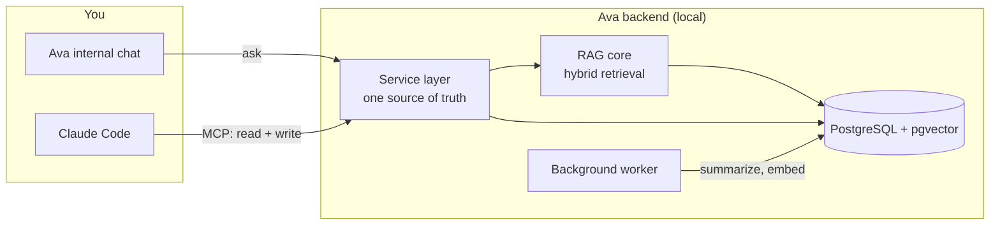
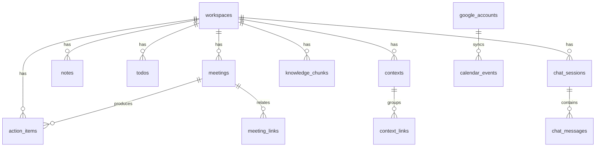
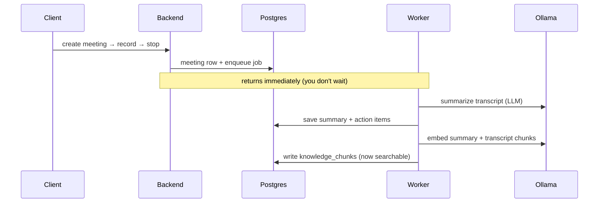
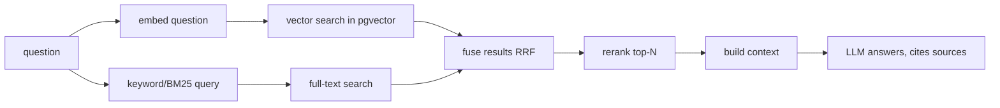
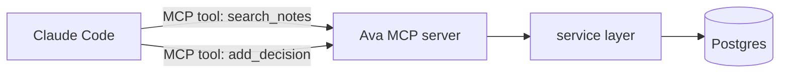
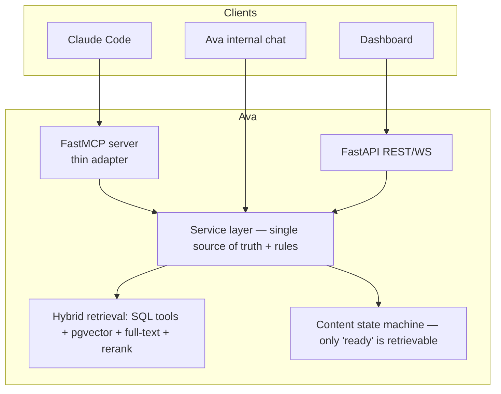

# Ava — Architecture & System Design

> A didactic tour of how Ava is built. Assumes you can code but not that you know FastAPI, vector databases, or RAG. Every concept and library is explained the first time it appears.

---

## 1. What Ava is (in one paragraph)

Ava is a **local, private "second brain"**: a backend that ingests your documents, meeting/call summaries, notes, action items, and decisions, stores them durably, and lets an AI **answer questions grounded in that knowledge** instead of guessing. It runs on your machine — your data never leaves it unless you choose a cloud model. Two things talk to it:

1. **Ava's own internal chat** — you, talking directly to your knowledge base ("what did we decide about X?").
2. **Claude Code**, via an **MCP server** — so you can tell Claude "remember this decision", "what are my open action items", "search my notes about Y", and Claude both **reads from** and **writes into** Ava.

The AI quality of #1 and #2 depends almost entirely on one thing: **how good the retrieval (RAG) is**. That is the heart of the project (see [rag-pipeline.md](rag-pipeline.md) and [rag-handbook.md](rag-handbook.md)).

> **History:** Ava began as a voice assistant with a 3D avatar. That direction is archived (the voice "companion" and avatar are dead code kept for reference). The living product is the knowledge/meeting/memory backend described here.

---

## 2. The mental model



Everything funnels through **one service layer** so that rules (which workspace, permissions, validation) are enforced in exactly one place, no matter who is calling.

---

## 3. The tech stack — what each piece is and why it's here

| Layer | Library / tool | What it does | Why it was chosen |
|---|---|---|---|
| **Web framework** | **FastAPI** | Turns Python functions into an HTTP API with automatic validation and OpenAPI docs | Async-native, fast, great DX, auto-generates the API contract |
| **ASGI server** | **Uvicorn** | The process that actually runs the async app and serves HTTP/WebSocket | Standard for FastAPI; supports async + websockets |
| **Validation** | **Pydantic v2** / **pydantic-settings** | Defines request/response shapes and loads config from `.env` with type checking | Catches bad data at the edge; config becomes a typed object |
| **ORM** | **SQLAlchemy 2.0 (async)** | Maps Python classes ↔ database tables; builds SQL safely | Industry standard; async works with FastAPI's event loop |
| **DB driver** | **asyncpg** / **psycopg** | Talks to PostgreSQL over the network asynchronously | Fast async Postgres access |
| **Database** | **PostgreSQL** | The durable store — the "source of truth" for all records | Reliable, relational, and hosts pgvector |
| **Vector search** | **pgvector** | A Postgres extension that stores embeddings and finds "nearest" ones | Keeps vectors *in the same DB* as the data — one store, transactional, filterable |
| **Migrations** | **Alembic** | Versioned, repeatable changes to the DB schema | Lets the schema evolve safely across machines |
| **Job queue** | **procrastinate** | Runs slow work (summaries, embeddings) in the **background**, using Postgres as the queue | No extra infra (no Redis); jobs survive restarts |
| **LLM orchestration** | **LangChain** + **LangGraph** | Wraps different LLM providers behind one interface and runs the "call model → maybe call a tool → repeat" loop | Provider-agnostic; LangGraph's `create_react_agent` gives tool-calling for free |
| **LLM runtime (local)** | **Ollama** | Runs local models (LLM + embeddings) via a simple HTTP API | Free, offline, private |
| **Transcription (STT)** | **faster-whisper** | Speech → text for meetings | Fast local Whisper with GPU/CPU fallback |
| **Speech synthesis (TTS)** | **Kokoro (ONNX)** / **Coqui XTTS** | Text → speech (part of the archived voice path) | Local, CPU-friendly |
| **Embeddings** | **nomic-embed-text** (via Ollama) + **sentence-transformers** (reranker) | Turns text into vectors; the reranker re-scores search hits | Local, strong on English; decision: **keep it** |
| **Integration protocol** | **MCP (Model Context Protocol)** | A standard way to expose "tools" and "resources" to AI clients like Claude Code | Lets Claude Code use Ava without custom glue |
| **Secrets** | **cryptography (Fernet / AES-256)** | Encrypts API keys/tokens at rest in a vault | Secrets never sit in `.env` in plaintext |

**Key idea to internalize:** *the database is the source of truth; the vector index is a derived, rebuildable view of it.* If embeddings are ever wrong, you can always re-generate them from the records. Never treat the vector store as primary.

---

## 4. Component map (backend)

```
backend/
├── main.py            # builds the FastAPI app, wires singletons, mounts routers, starts background loops
├── worker.py          # SEPARATE process: runs the procrastinate background worker
├── api/               # HTTP/WS routers — thin: parse request → call a service → return
│   ├── deps.py        #   shared dependencies (e.g. "which workspace is this request for?")
│   └── *.py           #   meetings, notes, todos, action_items, alerts, calendar, contexts,
│                      #   knowledge, chats, plugins, mcp, secrets, jobs, transfer, workspaces...
├── core/
│   ├── db/            # models.py (tables), engine.py (async connection), embeddings.py (Ollama embed)
│   ├── knowledge/     # rag.py (retrieval), ingestion.py (chunking), meeting_doc.py (meeting → markdown)
│   ├── jobs/          # app.py (procrastinate), tracker.py (JobTask rows), tasks/* (the actual jobs)
│   ├── llm/           # provider.py (pick a model), agent.py (LangGraph agent + context compaction)
│   ├── memory/        # chat_history.py, summarizer.py (compaction that preserves key entities)
│   ├── plugins/       # registry.py (which tools per workspace), mcp_manager.py (external MCP client)
│   └── secrets/       # vault.py + crypto.py (encrypted secrets)
├── tools/             # the LangChain tools the internal agent can call (search_meetings, get_context, ...)
└── alembic/           # database migrations 001 → 009
```

**Layering rule (aspirational, partly true today):** `api/` should be thin and delegate to a **service layer**; services own the DB + rules; `tools/` and the future MCP server should call the *same* services. Today some routers contain business logic directly — a cleanup target (see the audit).

---

## 5. The data model (the domain)

Every content type is a table in PostgreSQL. The important ones:



| Table | Holds | Notes for you |
|---|---|---|
| `workspaces` | The isolation boundary (`personal`, `work`, …) | Almost everything has a `workspace_id` pointing here |
| `meetings` | Transcript, summary, decisions, status | Source of truth for a meeting |
| `knowledge_chunks` | Text chunks + their **embedding** (`vector(768)`) | This is the RAG index. Derived from documents/meetings/notes |
| `notes` / `todos` / `action_items` / `alerts` | Structured productivity records | Retrieved by exact SQL, not vector search |
| `contexts` + `context_links` | A "context" = a named bundle grouping items across types (like a project folder) | The internal agent can read a whole context on demand |
| `chat_sessions` + `chat_messages` | Conversation history | History is stored; only a compacted view is sent to the LLM |
| `calendar_events` + `google_accounts` | Synced calendar (multi-account, unified view) | **Deliberately cross-workspace** — you want to see both calendars at once |
| `job_tasks` | Tracks background jobs (queued/running/done/failed) | Mirrors procrastinate's own internal queue |
| `secrets` | Encrypted API keys/tokens | Never returned in plaintext by the API |

**Two kinds of data, two retrieval strategies (remember this):**
- **Structured records** (action items, todos, calendar) → fetched by precise **SQL filters** (`status='open'`, `date > …`). Vectorizing them would only lose precision.
- **Unstructured text** (documents, transcripts, note bodies) → fetched by **semantic + lexical (RAG)**, because you search them by *meaning*, not by exact fields.

---

## 6. Core data flows

### 6a. Meeting lifecycle (record → searchable)



The lesson: **slow AI work is asynchronous.** The API responds instantly; the worker finishes the heavy lifting later. This is why *the worker must be running* — otherwise meetings record but never become searchable.

### 6b. Ingestion (documents / Claude Code feeding Ava)

```
file / markdown / note  →  parse  →  chunk  →  embed each chunk  →  store in knowledge_chunks
                                     (with metadata: source, type, date, workspace, status)
```

The **same path** serves a user uploading a PDF and Claude Code calling an `add_document` MCP tool. Ingestion, chunking, and embedding are covered in depth in [rag-pipeline.md](rag-pipeline.md).

### 6c. Answering a question (RAG)



Both the internal chat and Claude Code (via MCP) use this same core. Getting each arrow right is what makes retrieval "impeccable."

### 6d. Claude Code ↔ Ava (target)



Claude Code discovers Ava's tools over MCP and calls them like any other tool. Because they hit the same service layer, permissions and workspace rules apply identically whether the caller is you, the internal chat, or Claude.

---

## 7. Concurrency & processes

Ava is not one process. On a running machine you have:

| Process | Role | Required? |
|---|---|---|
| **PostgreSQL** (Docker) | data + vectors | always |
| **Ollama** | local models | for local mode |
| **Backend** (Uvicorn) | API + WS | always |
| **Worker** (procrastinate) | background jobs | for meetings/notes/ingestion |
| **Frontend** (Next.js) | dashboard | optional |

Inside the backend, everything is **async** (`async def`): while one request waits on the DB or the LLM, others proceed on the same thread. Slow, CPU-bound, or long work is pushed to the **worker** so it never blocks the API. A **state machine** (`core/state_machine.py`) guards mode changes with a lock so two transitions can't race.

---

## 8. Where the architecture is going (target design)

The recommended end-state (called "Alternative C" in the audit):



Principles:
1. **One service layer** = one place for workspace rules, permissions, validation.
2. **Hybrid retrieval**, not "vectorize everything." Structured data → SQL; text → semantic + lexical.
3. **A content-processing state machine** so half-finished/failed content (e.g. a placeholder "summary unavailable") can **never** be retrieved.
4. **A thin MCP server** exposing the same services to Claude Code — read *and* write.
5. **Calendar is the one intentional cross-workspace view**; everything else is isolated.

---

## 9. Workspaces & permissions

- A **workspace** (`personal`, `work`, project-x) isolates data. When you're in `personal`, you must not see `work`'s meetings/notes.
- **Exception:** the unified **calendar** deliberately shows all accounts at once.
- **Cross-workspace AI access** must be **explicit, scoped, and audited**: the agent may know another workspace *exists* (its name) but cannot read its content until you grant permission ("you asked about the Tabby launch, which is in `work` — allow me to search it?"). Grants expire; every crossing is logged.
- Enforcement belongs in the **service layer / a shared dependency**, not scattered per-endpoint (today it's inconsistent — a known bug).

---

## 10. Design decisions & rationale

| Decision | Why |
|---|---|
| **Local-first** (Ollama, local Whisper/embeddings) | Privacy + zero recurring cost; cloud models are opt-in via `.env` |
| **Postgres + pgvector as one store** | Vectors live next to the data → transactional, filterable, one backup, no second system to sync |
| **procrastinate over Celery/Redis** | Uses the DB you already have; one less moving part |
| **Encrypted secrets vault, not `.env`** | API keys/tokens are encrypted at rest; the API never returns full values |
| **DB is source of truth; index is derived** | You can always rebuild embeddings; corruption in the index is recoverable |
| **MCP as a thin adapter over services** | Keeps Ava client-agnostic — Claude Code today, anything MCP-capable tomorrow |
| **Compaction preserves entities, never mutates history** | Long chats get summarized *for the LLM only*; stored history stays intact; names/facts are kept verbatim |

---

## 11. Current health (snapshot)

- ✅ Boots, imports clean, **181/181 tests pass**, migrations at a single head, 73 API routes.
- ⚠️ Known correctness issues being addressed: workspace isolation gaps, meeting search, duplicate/stale/orphaned vector chunks, a background job that always failed, and a broken calendar/OAuth vault call. (Full detail is in the external audit doc.)
- The RAG core is functional (pgvector + reranker) but **not yet hybrid** and lacks rich metadata — the upgrade is specified in [rag-pipeline.md](rag-pipeline.md).

---

## 12. Glossary

- **Embedding** — a list of numbers (a *vector*, here 768 of them) representing the *meaning* of a piece of text. Similar meanings → nearby vectors.
- **Vector search / semantic search** — finding text whose embedding is closest to the query's embedding (by cosine distance). Matches by meaning, not exact words.
- **pgvector** — the Postgres extension that stores embeddings and does that nearest-neighbor search.
- **HNSW** — "Hierarchical Navigable Small World", the index pgvector uses to make nearest-neighbor search fast (approximate but very fast).
- **Chunk** — a small slice of a document (e.g. ~500 words). You embed and retrieve *chunks*, not whole documents, so results are precise.
- **RAG (Retrieval-Augmented Generation)** — retrieve relevant chunks, then let the LLM answer *using them*. Reduces hallucination and grounds answers in your data.
- **BM25 / full-text search** — classic keyword search ranking by term frequency. Great for exact terms (names, IDs) that embeddings can miss.
- **Hybrid search** — combining vector + keyword results (often via *Reciprocal Rank Fusion*) to get the best of both.
- **Reranker (cross-encoder)** — a model that re-scores the top candidate chunks against the query more accurately than the first-pass search, then keeps the best few.
- **Reciprocal Rank Fusion (RRF)** — a simple formula to merge two ranked lists (vector + keyword) into one.
- **LLM** — Large Language Model (the text generator: Llama, Qwen, Claude, GPT…).
- **Tool calling** — when the LLM, instead of answering, emits a request to run a function (a "tool"), gets the result, and continues.
- **Agent** — an LLM in a loop that can call tools until it can answer. Here: LangGraph's `create_react_agent`.
- **ReAct** — "Reason + Act": the pattern where the model alternates thinking and tool calls.
- **MCP (Model Context Protocol)** — a standard letting AI clients (Claude Code) discover and call an app's **tools** and read its **resources**.
- **ORM** — Object-Relational Mapper (SQLAlchemy): write Python objects, it writes SQL.
- **Migration** — a versioned change to the DB schema (Alembic), so every machine ends up with the same tables.
- **ASGI** — the async server interface Uvicorn implements to run FastAPI.
- **Workspace** — Ava's data isolation boundary (personal vs work).
- **Reranking vs retrieval** — retrieval casts a wide net cheaply; reranking precisely orders the catch.

---

*Read next: [rag-pipeline.md](rag-pipeline.md) for the concrete retrieval design, then [rag-handbook.md](rag-handbook.md) to understand every option behind it.*
