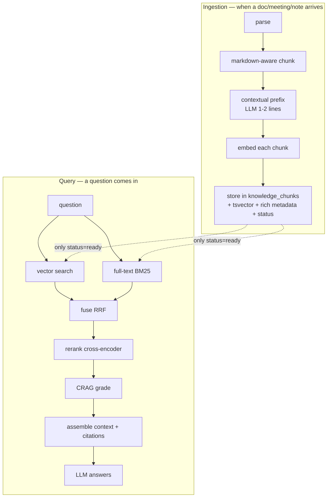

# Ava — The RAG Pipeline (concrete & applied)

> The recommended retrieval architecture for Ava, specific to this stack (PostgreSQL + pgvector, Ollama, local models) and this content (Markdown docs + meeting/call summaries, English-heavy). Read [rag-handbook.md](rag-handbook.md) for the theory behind each choice.

The goal: **impeccable retrieval** so both the internal chat and Claude Code get precise, grounded context — never noise, never stale, never cross-workspace leaks.

---

## 0. The pipeline at a glance



Two invariants to hold above all:
1. **Only `ready` content is retrievable.** Half-processed, failed, or placeholder text must never reach vector/BM25 search.
2. **Every query is workspace-scoped.** No retrieval without a `workspace_id` predicate.

---

## 1. Ingestion

### 1.1 The `documents` + `knowledge_chunks` split

Introduce a canonical **`documents`** table (source of truth for ingested content) separate from **`knowledge_chunks`** (the derived, rebuildable index):

```
documents        : id, workspace_id, source (unique key), content_hash, title, doc_type,
                   date, tags[], status, source_document_id (nullable, for derived docs),
                   created_at, updated_at
knowledge_chunks : id, document_id (FK ON DELETE CASCADE), workspace_id, embedding vector(768),
                   text, context_prefix, tsv tsvector, source_type, section_path[],
                   chunk_index, total_chunks, status, created_at
```

Why: `content_hash` on `documents` makes re-ingestion **idempotent**; the `ON DELETE CASCADE` makes deletion clean (delete the document → its chunks vanish — no orphans, which is a current bug).

### 1.2 Chunking (markdown-aware first)

For **Markdown documents** (your main input):
1. Split on headers (`#`, `##`, `###`). Each section is a candidate chunk.
2. Keep the **header path** and prepend it to the chunk (`section_path = ["Meeting", "Action Items"]`). A chunk saying "confirmed for next Wednesday" is useless without "Action Items" above it.
3. If a section > ~512 tokens, split at paragraph boundaries with **10–15% overlap**.
4. Keep code blocks intact; tag `content_type=code`.

For **meeting/call summaries** (short, structured): split by section (`## Summary`, `## Decisions`, `## Action Items`) and index each independently — this makes "what were the action items on Apr 12?" precise.

Default sizes: **~200–400 tokens, 15–20% overlap.** (Research note: fixed ~200-word chunks match or beat semantic chunking in 2025 benchmarks at far lower cost — don't over-engineer chunking early.)

### 1.3 Contextual retrieval (the highest-leverage upgrade)

For each chunk, ask a **local Ollama model** to write 1–2 sentences situating it in its document, and store it in `context_prefix`:

> "From the Q3 strategy meeting (2026-04-12); this section covers the decision to delay the mobile launch to Q1."

Then embed and BM25-index **`context_prefix + "\n" + text`** (store both; embed the concatenation). Anthropic's published results: contextual embeddings cut retrieval failures **35%**; with contextual BM25, **49%**; add reranking, **67%**. It's a batch job at ingest time — cost is local inference, not dollars.

### 1.4 Embedding

- Model: **upgrade `nomic-embed-text` → `nomic-embed-text-v2-moe`** (same Ollama API, same 768 dims, adds real multilingual/PT support; Feb 2025). Drop-in.
- Batch the chunks; one embed call per chunk today (fine). Store as `vector(768)`; consider `halfvec(768)` if the corpus grows large (halves storage, negligible recall loss).

### 1.5 State machine (gate indexing)

Set `documents.status` / `knowledge_chunks.status` through: `pending → chunking → embedding → ready` (or `failed`). **Retrieval filters `status='ready'`.** If summarization produced a placeholder (`"(summary unavailable)"`), mark `failed` and **do not embed it** — that placeholder polluting the index is a current bug.

### 1.6 Idempotent upsert + deletion

- **Upsert by `source` + `content_hash`:** unchanged → skip; changed → delete old chunks, re-embed; new → insert. (Kills duplicate chunks on retry/re-upload — a current bug.)
- **Delete:** delete the `documents` row → chunks cascade. (Kills orphan chunks on meeting delete — a current bug.)
- **Edit:** on transcript/summary edit, set `status='superseded'` and re-enqueue processing (delete-then-reinsert). (Kills stale embeddings on edit — a current bug.)

---

## 2. Retrieval (hybrid)

### 2.1 The two arms + RRF fusion

Run **vector** and **BM25 full-text** in parallel, over-fetch ~60 each, fuse with **Reciprocal Rank Fusion** (k=60), take top ~20:

```sql
SET hnsw.iterative_scan = 'strict_order';   -- REQUIRED with WHERE filters

WITH vec AS (
  SELECT id, ROW_NUMBER() OVER (ORDER BY embedding <=> :qvec) AS rank
  FROM knowledge_chunks
  WHERE workspace_id = :ws AND status = 'ready' AND embedding IS NOT NULL
  ORDER BY embedding <=> :qvec LIMIT 60
),
fts AS (
  SELECT id, ROW_NUMBER() OVER (ORDER BY ts_rank_cd(tsv, q) DESC) AS rank
  FROM knowledge_chunks, plainto_tsquery('simple', :qtext) q
  WHERE workspace_id = :ws AND status = 'ready' AND tsv @@ q
  ORDER BY ts_rank_cd(tsv, q) DESC LIMIT 60
)
SELECT COALESCE(v.id, f.id) AS id,
       COALESCE(1.0/(60+v.rank),0) + COALESCE(1.0/(60+f.rank),0) AS score
FROM vec v FULL OUTER JOIN fts f USING (id)
ORDER BY score DESC LIMIT 20;
```

Why hybrid: vectors match *meaning* but miss exact tokens (names, IDs, acronyms, meeting titles); BM25 nails those. Reported recall jumps ~62% → ~84%. **This directly fixes your "can't find a meeting by exact title" bug** — the title lives in BM25's reach.

Index for BM25 (use `'simple'` to stay language-neutral for EN+PT mix, or maintain EN+PT tsvector columns and OR them):
```sql
ALTER TABLE knowledge_chunks ADD COLUMN tsv tsvector GENERATED ALWAYS AS
  (to_tsvector('simple', coalesce(context_prefix,'') || ' ' || coalesce(text,''))) STORED;
CREATE INDEX idx_chunks_tsv ON knowledge_chunks USING gin(tsv);
```

### 2.2 Metadata filtering

Push structured constraints into the `WHERE` before the vector op: `workspace_id` (always), `status='ready'` (always), plus `doc_type`, `date` ranges, `tags`, `source_type`. Requires `hnsw.iterative_scan='strict_order'` or you may get fewer than `LIMIT` rows.

### 2.3 Reranking

Feed the top ~20 fused candidates to a **cross-encoder** and keep the top ~5:
- Model: **`bge-reranker-v2-m3`** (MIT, multilingual — handles your PT without a second model). You already have `sentence-transformers`.
- Cost ~50–200ms/20 on GPU — acceptable.

### 2.4 CRAG grade (anti-hallucination)

Before generating, grade the top chunk's relevance (a quick local LLM yes/no or the reranker score threshold). If it fails, **don't fabricate** — reformulate the query once, or tell the user you don't have it. This is the concrete implementation of your requirement "if unsure, don't hallucinate — re-search."

### 2.5 Structured vs semantic routing

Don't vectorize everything. Route by intent:
- "open action items for João", "meetings last week", "todos due today" → **SQL tools** (exact, filterable). Ava already has these (`get_action_items`, `list_recent_meetings`).
- "what did we discuss about the pricing model" → **hybrid RAG**.
An agent (or a small classifier) picks the tool. This is why Ava keeps both structured tools *and* semantic search.

---

## 3. Generation

- Assemble the top reranked chunks into the prompt with **explicit source citations** (`[meeting:Apr-12 §Decisions]`) so answers are traceable.
- Budget the context window; if too many chunks, keep highest-reranked.
- Instruct the model to answer **only** from context and to say "I don't have that" otherwise (pairs with CRAG).
- Both consumers (internal chat, Claude Code via MCP) share this core.

---

## 4. Claude Code ↔ Ava (MCP server, read + write)

Expose Ava's retrieval and ingestion as an **MCP server** (FastMCP) so Claude Code can both **query** and **feed** it. Use **tools** (not resources — Claude Code's tool support is complete; resource support is partial).

**Read tools:** `search_knowledge(query, workspace, limit, tags)`, `get_document(id)`, `list_documents(workspace, doc_type, limit, offset)`.
**Write/ingest tools:** `add_document(content, source, title, doc_type, tags, workspace, date)`, `add_meeting_summary(...)`, `add_decision(title, context, outcome, date, decision_id, ...)`, `delete_document(id)`.

Rules for the write tools:
- **Idempotent** via `source` + `content_hash` (skip unchanged, replace changed).
- Ingest goes through the **same** chunk→context→embed pipeline as §1.
- Cap tool output (~50 KB); search returns 200–500-token snippets, not full docs; `get_document` fetches full text on demand; paginate `list_documents`.

Connect it:
```bash
# stdio (simplest for local): Claude Code spawns it on demand
claude mcp add ava-kb -- python /abs/path/backend/mcp_server.py
```
Or streamable-HTTP if you want it to share Ava's always-running process:
```python
mcp.run(transport="streamable-http", host="127.0.0.1", port=8473)
```

Example flow:
> You → Claude Code: "remember we decided to keep nomic embeddings."
> Claude → `add_decision(title="Keep nomic embeddings", context="...", outcome="...", date=..., decision_id="decision-2026-07-02-embeddings")`
> Later: "what did we decide about embeddings?" → Claude → `search_knowledge("embedding model decision", workspace="personal")` → grounded answer.

---

## 5. Evaluation (how you *know* it's impeccable)

You cannot tune what you don't measure. Build a small **golden set** and measure every change:
1. Auto-generate candidate questions from your own docs (LLM: "3 questions this doc answers"), keep `(question, expected_source_ids)`.
2. Hand-write expected answers for ≥20.
3. Store as JSON: `[{question, expected_answer, expected_source_ids}]`.
4. Measure **Hit Rate@5** and **MRR** for retrieval; **faithfulness** + **answer relevancy** for generation (via **RAGAS** with a local Ollama judge — no cloud, matches local-first).
5. **Change one variable at a time** (chunk size, embed model, reranker on/off, hybrid on/off) and keep what moves the metric.

Targets to aim for: Hit Rate@5 ≥ 0.85, MRR ≥ 0.7 to start. See [rag-handbook.md](rag-handbook.md) §Evaluation for details.

---

## 6. Ava-specific rollout order

| Priority | Change | Fixes / enables |
|---|---|---|
| 1 | Hybrid search (add `tsv` + RRF) + `hnsw.iterative_scan='strict_order'` | meeting-title search, recall |
| 2 | `documents` table + `content_hash` upsert + `ON DELETE CASCADE` + `status` gating | duplicate/orphan/stale/placeholder chunks |
| 3 | Markdown-aware chunking + `section_path` metadata | precision on structured docs |
| 4 | `bge-reranker-v2-m3` reranker | ranking quality |
| 5 | Contextual retrieval (Ollama prefix) | −35–49% retrieval failures |
| 6 | Upgrade embed model → `nomic-embed-text-v2-moe` | PT quality, one-time re-embed |
| 7 | Golden-set eval harness (RAGAS + local judge) | measure everything above |
| 8 | MCP server (read+write tools) | Claude Code integration |
| 9 | CRAG grader | anti-hallucination |
| later | sentence-window / parent-child; RAPTOR (200+ docs) | long-doc & global-theme queries |

---

*Theory & alternatives for every choice above: [rag-handbook.md](rag-handbook.md).*
